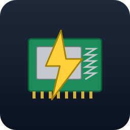
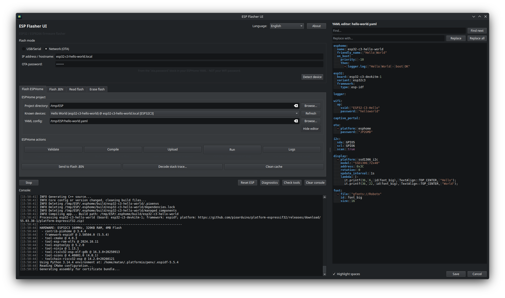

#  ESP Flasher UI

PyQt6 GUI for flashing ESP32 / ESP8266 modules via USB or OTA.

> **Easiest start:** grab the `full` AppImage from the [Releases page](../../releases). It bundles a relocatable CPython 3.12, PyQt6, `esphome`, `esptool` and `platformio` - self-contained, zero setup, no system Python required. Just `chmod +x` and run.

> **Architecture note:** under the hood ESP Flasher UI is a thin GUI wrapper - every flash / OTA / build / log action is delegated to `esptool`, `espota.py` or `esphome`. The `full` AppImage ships these CLIs. The `light` AppImage and source installs need them in `PATH` (e.g. `pip install -r requirements.txt` in a venv); without them the app starts but every action fails with "tool not found". Click **Diagnostic** after launch to verify - it prints both the environment snapshot and the tool checklist.

> **Target platform:** Linux (tested on Kubuntu 26.04).

> **Translations notice:** All language packs are machine-translated and may contain errors. Pull requests with corrections are welcome.

---

## Features

- **Flash ESPHome tab** - full workflow: validate / compile / upload / run / logs / clean.
- **Flash .BIN tab** - pick a raw firmware binary and push it to the device.
- **Read flash tab** - USB-only flash dump to a local `.bin` (full backup, app-only or bootloader presets, custom offset + length, chip auto-detect).
- **Erase flash tab** - rescue bricked modules with `esptool erase-flash` behind a confirmation checkbox that auto-unchecks after every click.
- **Shared device selector** - USB/Serial or Network (OTA), used by all tabs.
- **OTA detection** - DNS resolve + TCP probe on ESPHome ports (6053, 3232, 8266) with private/public IP classification.
- **Known devices** - auto-discovers ESPHome manifests from `.esphome/storage/*.yaml.json`.
- **Quick View/Edit side panel** - inline YAML viewer/editor docked to the right of the main window with syntax highlighting, an optional **Highlight spaces** toggle that overlays a `░` glyph on every space, find / find & replace, save / cancel; the window auto-resizes when the panel opens or closes.
- **Bridge button** - forward a compiled `firmware.bin` from ESPHome tab to Flash .BIN tab.
- **Console** - timestamped output, ANSI stripping, colour-coded log levels, `>> ` prefix on app-emitted lines so they stand out from raw `esptool` / `esphome` output, permission-denied hint for `/dev/tty*` access.
- **Troubleshooting hints** - passive log scanner that flags ESPHome crashes (`Guru Meditation`, `task_wdt`, `abort()`), the "took a long time for an operation" warning, missing-ELF prompts when ESPHome cannot auto-decode a stack trace, and `VERY_VERBOSE` YAML pre-validation.
- **Stack trace decoder** - modal dialog that resolves crash addresses via `addr2line` against a `firmware.elf` (auto-detects ESP32 / ESP8266 / RISC-V toolchains, ranks `firmware.elf` ahead of bootloader/partition ELFs).
- **Reset ESP** - one-click hard reset of the connected USB device via DTR/RTS toggling (`esptool --no-stub chip-id`).
- **Cancellable operations** - global **Stop** button cancels the running flash / compile / log / read / erase / reset subprocess without closing the window.
- **Runtime language switcher** - language picker in the header re-translates the whole UI without restart.
- **Diagnostic** - one-click environment dump (platform, cwd, serial ports, languages, current mode, firmware path, ESPHome project) plus the dependency checklist (Python, PyQt6, esptool, esphome, espota, pyserial, `dialout` group with stale-session detection).

---

<p align="center">
  
</p>

---

## Quick start

### Option A: AppImage (no install required)

Grab the latest AppImage from the [Releases page](../../releases). Each release ships with a relocatable CPython 3.12 interpreter embedded via [python-build-standalone](https://github.com/astral-sh/python-build-standalone), so no system Python is required - the AppImage runs on any modern Linux x86_64 distribution.

Two flavours are published:

- `esp-flasher-ui-<version>-light-x86_64.AppImage` - bundles CPython + PyQt6 + pyserial. Install `esphome` / `esptool` from your system pip; the GUI picks them up via `PATH`.
- `esp-flasher-ui-<version>-full-x86_64.AppImage` - bundles CPython + PyQt6 + pyserial + esphome + esptool + platformio. Fully self-contained: no system pip packages required.

| Component | Light | Full | Source |
|---|:---:|:---:|---|
| CPython | `3.12.13` (pinned) | `3.12.13` (pinned) | `python-build-standalone` release `20260510` |
| PyQt6 | `>=6.11.0` | `>=6.11.0` | pip |
| pyserial | `>=3.5` | `>=3.5` | pip |
| esptool | - (system `PATH`) | `>=5.2.0` | pip |
| esphome | - (system `PATH`) | `>=2026.5.1` | pip |
| platformio | - | bundled | transitive dependency of `esphome` |
| `espota.py` | - (via `esphome`) | bundled | shim provided by the build script |
| `addr2line` toolchains | system / user `~/.platformio` | user `~/.platformio` (populated on first compile) | not bundled - host-resolved at runtime |

```bash
chmod +x esp-flasher-ui-*-x86_64.AppImage
./esp-flasher-ui-*-x86_64.AppImage
```

The AppImage uses standard FUSE; on minimal systems pass `--appimage-extract-and-run` to bypass FUSE.

Each release is smoke-tested in CI on Ubuntu 22.04 / 24.04 / 26.04 LTS, Debian 13 (Trixie), Fedora 43 and Arch Linux.

### Option B: from source

#### 1. System packages (Debian / Ubuntu)

```bash
sudo apt install -y python3 python3-venv python3-pip \
  libgl1 libegl1 libfontconfig1 \
  libxcb-cursor0 libxkbcommon-x11-0
```

#### 2. USB permissions

```bash
sudo usermod -aG dialout $USER
# then LOG OUT and back in (full session restart required)
```

#### 3. Install

```bash
cd ESP-Flasher-UI
python3 -m venv .venv
source .venv/bin/activate
pip install --upgrade pip
pip install -r requirements.txt
```

#### 4. Run

```bash
source .venv/bin/activate
python main.py
```

Click **Diagnostic** after launch - the bottom section lists every required tool with `[V]` or `[X]`.

#### 5. Run tests (optional)

```bash
QT_QPA_PLATFORM=offscreen python build-tools/tests.py
```

Headless offline test suite (~370 checks) covering i18n integrity (37 packs, `_meta` consistency, placeholder consistency), workers, console classifier and `>> ` prefix, stack decoder with ELF prioritization, hint detection, Quick View/Edit panel, Read / Erase / Reset operations with their safety guards, and a GUI smoke test for every tab.

---

## Architecture

ESP Flasher UI is a thin wrapper - all flashing is delegated to external CLI tools:

| UI action | Command | Tool |
|-----------|---------|------|
| Flash .BIN (USB) | `esptool --chip auto --port <dev> [--baud <rate>] write-flash 0x0 <fw.bin>` | `esptool` |
| Flash .BIN (OTA) | `espota.py -i <host> -f <fw.bin> [-a <password>]` | `esphome` (bundles `espota.py`) |
| ESPHome workflow | `esphome {config\|compile\|upload\|run\|logs\|clean} <yaml> [--device <dev>]` | `esphome` |
| Read flash | `esptool --port <dev> [--baud <rate>] read-flash <offset> <length\|ALL> <out.bin>` | `esptool` |
| Detect chip | `esptool --chip auto --port <dev> [--baud <rate>] flash-id` | `esptool` |
| Erase flash | `esptool --port <dev> [--baud <rate>] erase-flash` | `esptool` |
| Reset ESP | `esptool --port <dev> [--baud <rate>] --no-stub chip-id` (DTR/RTS dance + hard reset on exit) | `esptool` |
| OTA detection | DNS resolve + TCP probe on ports 6053 / 3232 / 8266 | - |
| Stack decoding | `<toolchain>-addr2line -e firmware.elf -f -p -i -C <addresses>` | PlatformIO toolchain or system `addr2line` |

---

## Usage

### USB/Serial flashing

1. Plug in the ESP module, select **USB/Serial** mode.
2. Pick the device from the dropdown (click **Refresh** if needed).
3. Choose a baud rate. Defaults to `460800` (safe on all supported chips). Pick **Auto** to fall back to esptool's `115200` if a higher speed misbehaves on a bad cable / weak USB-UART bridge. Drop to `9600` or `57600` for long / noisy cables and flaky adapters.
4. Choose a `.bin` file and click **Flash**.

Baud rate guidance:

| Speed | ESP8266 | ESP32 / S2 (external USB-UART) | ESP32-S3 / C3 / C6 (native USB-CDC) |
|---|:---:|:---:|:---:|
| 9600, 57600 (rescue) | V | V | V |
| 115200, 230400, 460800 | V | V | V |
| 921600 | usually V | V | V |
| 1500000 | unreliable | works with quality bridge | V |
| 2000000 | fail | sometimes | V |

### OTA flashing

1. Select **Network (OTA)** mode.
2. Enter the device hostname or IP (e.g. `esp32.local` or `192.168.1.2`).
3. Enter the OTA password (from `ota.password` in your ESPHome YAML).
4. Optionally click **Detect device** to verify connectivity.
5. Choose a `.bin` file and click **Flash**.

### ESPHome workflow

1. Set the **Project directory** (folder with your `.yaml` configs).
2. Pick a **Known device** (auto-fills YAML path and OTA address) or browse for a YAML manually.
3. Use the action buttons:

| Action | Command | Needs device | Validate | Compile | Upload | Logs |
|--------|---------|:---:|:---:|:---:|:---:|:---:|
| **Validate** | `esphome config <yaml>` | no | V | - | - | - |
| **Compile** | `esphome compile <yaml>` | no | V | V | - | - |
| **Upload** | `esphome upload --device <dev> <yaml>` | yes | V | - | V | - |
| **Run** | `esphome run --device <dev> <yaml>` | yes | V | V | V | V |
| **Logs** | `esphome logs --device <dev> <yaml>` | yes | - | - | - | V |
| **Clean** | `esphome clean <yaml>` | no | - | - | - | - |

> The last four columns show which sub-phases each action covers. `Validate` is run implicitly by `Compile`, `Upload` and `Run` (the YAML is always parsed before any build / flash). `Run` is the full pipeline: `Compile + Upload + Logs`, with validation included.

After a successful compile, click **Send to Flash .BIN** to forward the built `firmware.bin` to the other tab. For the full pipeline in a single click, **Run** is the preferred path.

### Quick View/Edit YAML

A side panel docked to the right of the main window lets you view and edit the selected YAML without leaving the app.

1. Select a project + YAML in the ESPHome tab (the **Quick View** button below **Browse** unlocks).
2. Click **Quick View** - the window grows to make room for the panel and the YAML loads.
3. Use **Find**, **Find & Replace**, **Save** or **Cancel** in the panel. Modifications mark the title with `*` and bring up a discard prompt when closing with unsaved changes.
4. Click **Hide** (same button) to close - the window shrinks back to its previous width.

YAML syntax (keys, strings, comments, booleans, numbers, anchors) is highlighted. The **Highlight spaces** checkbox at the bottom of the panel is off by default; when enabled it overlays a faint `░` glyph on every space so indentation is unambiguous - the underlying file is untouched, only the rendering changes.

### Read flash (USB only)

Dump the device's SPI flash to a local `.bin` file.

1. Open the **Read flash** tab and select a USB device.
2. Pick a preset or set **Offset** and **Length** manually (accepts decimal or `0x...` hex). Leave **Length** empty for `ALL`.
3. (Optional) Click **Detect chip** to verify chip + flash size before dumping.
4. Click **Read flash** - progress streams in the console; the resulting `.bin` lands at the chosen path.

| Preset | Offset | Length |
|--------|-------:|-------:|
| **Full backup** | `0x0` | `ALL` |
| **Active app only** | `0x10000` | `0x200000` |
| **Bootloader + partitions** | `0x0` | `0x10000` |

### Erase flash (USB only - destructive)

Last-resort rescue for bricked modules that no longer boot or accept new firmware.

1. Open the **Erase flash** tab in USB mode.
2. Read the warning - this wipes the entire SPI flash. Saved Wi-Fi credentials, calibration, NVS and user partitions are gone.
3. Tick **I understand this will erase the flash...** - the red **Erase Flash** button activates.
4. Click **Erase Flash**. The checkbox auto-unchecks immediately so a second device cannot be wiped by reflex.

After erase, the device will not boot until you flash firmware again (use the Flash .BIN or Flash ESPHome tab).

### Reset ESP (USB only)

The **Reset ESP** button (left of **Diagnostics**, bottom action row) performs a hard reset of the connected USB device by toggling DTR/RTS through `esptool`. The chip enters bootloader mode briefly, then esptool releases RESET and the firmware boots normally.

---

## Languages

37 language packs included. The language menu sorts Latin-script names first (diacritics-folded), then Greek, then Cyrillic.

### Adding or fixing a language

1. Copy `app/translations/en.json` to `app/translations/<code>.json`.
2. Set `_meta.code`, `_meta.name`, `_meta.native_name`.
3. Translate the values (keep all keys and `{placeholder}` tokens intact).
4. Restart the app - the new language appears automatically.

---

## Troubleshooting

| Problem | Fix |
|---------|-----|
| `Permission denied: '/dev/ttyACM0'` | `sudo usermod -aG dialout $USER`, then **log out & back in** |
| Diagnostic says "IS in /etc/group but NOT in this process" | Full session restart needed (not just a new terminal) |
| `Could not load the Qt platform plugin "xcb"` | `sudo apt install libxcb-cursor0 libxkbcommon-x11-0` |
| `ModuleNotFoundError: PyQt6` | Activate venv: `source .venv/bin/activate && pip install -r requirements.txt` |
| OTA detection always fails | Verify device is on the same network; try `ping <host>`; check that ESPHome API/OTA is enabled in YAML |
| `A fatal error occurred: Invalid head of packet` during USB flash | Lower the baud rate to `460800` or `230400`; some USB-UART bridges (CP2102, CH340) and ESP8266 boards can't sync at higher speeds. If still failing, drop to `57600` or `9600` for long or noisy cables |
| OTA hostname resolves to a public IP (bold caption + console warning) | Avoid public TLDs in `hostname:` (e.g. `.world`, `.com`); use mDNS (`device.local`) or the LAN address directly |
| First `esphome compile` is slow | Normal - PlatformIO downloads the toolchain (~150 MB) on first build |
| Stack decoder reports "no `addr2line` found" | Compile the project at least once (populates PlatformIO toolchain under `~/.platformio/packages`) or install the GNU binutils `addr2line` |
| Stack decoder says "no addresses found" | The pasted text must contain `0x` hex values - paste the full `Backtrace:` / crash dump, not just the summary line |
| Module is bricked - no serial, no OTA, no boot | Open the **Erase flash** tab, tick the confirmation, click **Erase Flash**, then re-flash firmware from the Flash .BIN or Flash ESPHome tab |
| **Read flash** / **Erase flash** / **Reset ESP** buttons greyed-out or "USB only" warning | Switch the shared device selector from **Network (OTA)** to **USB/Serial**; these operations require a direct serial connection |
| Quick View/Edit button stays disabled | Select a YAML file first (the **Browse** button or a Known device entry); the **Quick View** toggle activates once a valid YAML path is set |
| Need to tell which lines are app messages vs tool output | App-emitted lines (status, hints, operation start/finish) carry a `>> ` prefix after the timestamp; raw `esptool` / `esphome` / `espota` output has none |

---

## Author

**Prodziekan**

- Email: [prodziekan.yt@gmail.com](mailto:prodziekan.yt@gmail.com)
- Website: [prodziekan-yt.github.io](https://prodziekan-yt.github.io)
- YouTube: [youtube.com/@Prodziekan](https://www.youtube.com/@Prodziekan)

---

## License

Released under the [MIT License](LICENSE).
